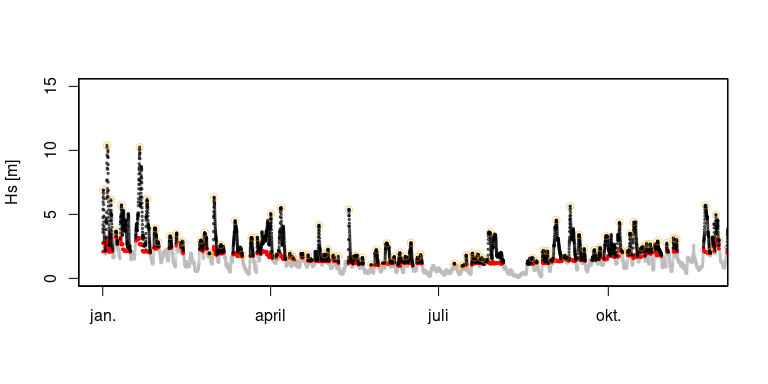

# MyPackage

<!-- badges: start -->
<!-- badges: end -->

EnvEx provides functions to model non-stationary and joint extremes.
Examples for a common metocean use case are provided.

## Installation

You can install the development version from GitHub with:

``` r
```

## Example

This is a basic example showing storm and peak picking.

``` r
# If installed:
library(evgam)
library(envex)

# subset ds_ekofisk to what is needed

ds <- df_ekofisk[, c("time", "hs", "wind_speed_10m", "tp", "tm2", "Pdir", "doy", "dt")]

# reduce data for test from 1976-01-01 to 1986-01-01
# ds_subset <- ds[1:87673,]  # 10 yrs for testing
ds_subset <- ds  # all yrs

# choose primary variable
prime_varstr = 'hs'

# make formula
nknots <- c(4, 6)  # c(8, 12), c(6, 8) is default c(4, 6) for testing
formula_string <- paste(prime_varstr, "~ te(doy, Pdir, bs = c('cc', 'cc'), k = nknots)")
peak_picking_thr_model_fml <- as.formula(formula_string)

# decorrelation time scale of 1 day
df_pick <- peak_picking(ds_subset, peak_picking_thr_model_fml,
                        decorrelation_time_scale = 1)
```

    ## [1] "apply threshold model to data"
    ## [1] "label storms"
    ## [1] "combine and relabel storm peaks that are too close"
    ## [1] "find peaks for combined storms"

``` r
# additional variables were added, i.e. exc, thr, and storm_idx
```

## Plot the resulting storms, storm peaks, and thresholds

``` r
visualize_storm_picking(dfin = df_pick, dfinall = ds,
                        xstr = "dt", ystr = "hs",
                        sidx = 1, eidx = 3500)
```

<!-- -->

## Notes

## License

## Development

To rebuild this README:

``` r
devtools::build_readme()
```
