# EnvEx - **Env**ironmental **Ex**tremes

<!-- badges: start -->
<!-- badges: end -->

EnvEx provides functions to model non-stationary and joint extremes.
Examples for a common metocean use case are provided.

## Installation

You can install the development version from GitHub with:

``` r
```

## Example

This is a basic example showing storm and peak picking.

``` r
# If installed:
library(evgam)
library(envex)

# subset ds_ekofisk to what is needed
# data from 1976-01-01 00:00:00 to 2023-12-31 23:00:00
df_ekofisk_red <- df_ekofisk[, c("time", "hs", "wind_speed_10m", "tp", "tm2", "Pdir", "doy", "dt")]

# reduce data for test from 1976-01-01 to 1986-01-01
# ds <- df_ekofisk_red[1:87673,]  # 10 yrs

# reduce data for test from 1976-01-01 to 1996-01-01
# ds <- df_ekofisk_red[1:175321,]  # 20 yrs

# full dataset
ds <- df_ekofisk_red  # 48 yrs

# number of years covered by original dataset
nr_of_years <- 48

# choose primary variable
prime_varstr = 'hs'

# make formula
nknots <- c(4, 6)  # c(8, 12), c(6, 8) is default c(4, 6) for testing
formula_string <- paste(prime_varstr, "~ te(doy, Pdir, bs = c('cc', 'cc'), k = nknots)")
peak_picking_thr_model_fml <- as.formula(formula_string)

# decorrelation time scale of 1 day
system.time(df_pick <- peak_picking(ds, peak_picking_thr_model_fml,
                                    decorrelation_time_scale = 1))
```

    ## [1] "apply threshold model to data"
    ## [1] "label storms"
    ## [1] "combine and relabel storm peaks that are too close"
    ## [1] "find peaks for combined storms"

    ##    user  system elapsed 
    ##  71.844   7.745  79.597

``` r
# additional variables were added, i.e. exc, thr, and storm_idx
```

## Plot the resulting storms, storm peaks, and thresholds

``` r
visualize_storm_picking(dfin = df_pick, dfinall = ds,
                        xstr = "dt", ystr = "hs",
                        sidx = 1, eidx = 4200)
```

<!-- -->

## Plot the Hs density

``` r
par(mfrow = c(1, 3))
plot(density(df_pick$pots$hs, bw=.1), main="Storm Peaks Hs [m]")
plot(density(df_pick$storms$hs, bw=.1), main="Storm Sea States Hs [m]")
plot(density(ds$hs, bw=.1), main="All Sea States Hs [m]")
```

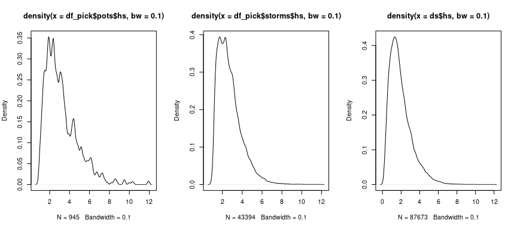<!-- -->

## Bootstrap the storms

``` r
# number of bootstrap/resampling steps
nbstrp <- 50  # e.g. nbstrp = 20 for testing

system.time(res_bstrp <- run_bootstrap_storms_pots(df = df_pick$storms,
                                                   group_col = "storm_idx",
                                                   n_boot = nbstrp,
                                                   max_var = prime_varstr))
```

    ##    user  system elapsed 
    ##  19.224   0.189  19.416

``` r
bstrp_storms_lst <- res_bstrp$boot_samples
bstrp_pots_lst <- res_bstrp$boot_max
```

## Plot the sampled within storm Hs densities

``` r
for (b in seq_len(nbstrp-1)) {
  plot(density(bstrp_storms_lst[[b]]$hs, bw=.1), xlim=c(0, 15), ylim=c(0., .5), xlab = "", ylab = "", xaxt = "n", yaxt = "n", main = "")
  par(new=TRUE)
}
plot(density(bstrp_storms_lst[[b+1]]$hs, bw=.1), xlim=c(0,15), ylim=c(0.,.5), main = "", xlab = "Hs", ylab = "Density")
```

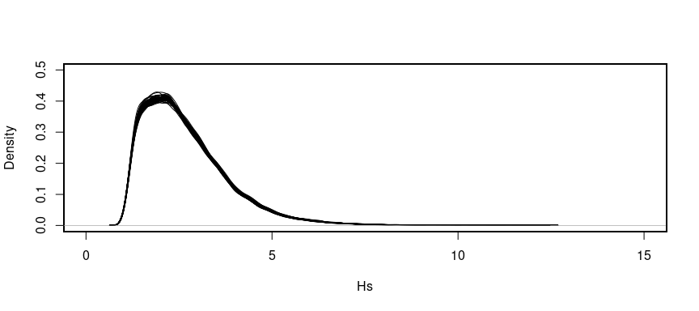<!-- -->

## Plot the sampled storm peak Hs densities

``` r
## Plot the within storm Hs
for (b in seq_len(nbstrp-1)) {
  plot(density(bstrp_pots_lst[[b]]$hs, bw=.1), xlim=c(0,15), ylim=c(0.,.5), xlab = "", ylab = "", xaxt = "n", yaxt = "n", main = "")
  par(new=TRUE)
}
plot(density(bstrp_pots_lst[[b+1]]$hs, bw=.1), xlim=c(0,15), ylim=c(0.,.5), main = "", xlab = "Hs", ylab = "Density")
```

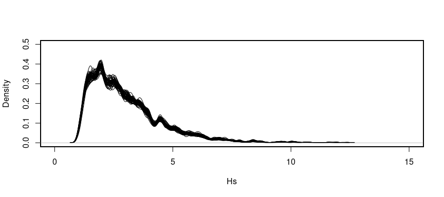<!-- -->

## Cross-validation for best threshold range

``` r
# possibly some figure on cross-validation
```

## Model the non-stationary storm peaks

``` r
library(ppgam)
library(extraDistr)
library(ggplot2)
library(extRemes)
# define knots for cyclic splines
knots = list(doy = c(0,366), Pdir=c(0,360))
# indicate variable that needs ppgam weights
node_str_lst = c('Pdir')

# threshold range from cross-validation
thr_range <- list('hs'=c(.75,.85))

# define models
fml_pp <- ~ te(doy, Pdir, bs = c('cc', 'cc'), k = c(4,6))
fml_gpd <- list(exc ~ te(doy, Pdir, k=c(4,6), bs=c("cc","cc")),
                ~ te(doy, Pdir, k=c(4,6), bs=c("cc","cc")))
fml_ald <- hs ~ te(doy, Pdir, bs=c("cc","cc"), k=c(4,6))
fml_ald_tm2 <- tm2 ~ te(doy, Pdir, bs=c("cc","cc"), k=c(4,6))

model_fml_thr <- NULL
model_fml_gpd <- NULL
model_fml_occ <- NULL
model_fml_occ[['hs']] <- fml_pp
model_fml_thr[['hs']] <- fml_ald
model_fml_gpd[['hs']] <- fml_gpd
model_fml_occ[['tm2']] <- fml_pp
model_fml_thr[['tm2']] <- fml_ald_tm2
model_fml_gpd[['tm2']] <- fml_gpd

syst <- system.time(
models_margs <- fit_margs_bstrp(bstrp_pots_lst,
                                model_fml_thr, model_fml_occ, model_fml_gpd,
                                extr_thr=thr_range, nr_of_years,
                                thr_str = 'thr',
                                list_var = c('hs','tm2'),
                                nbstrp = nbstrp,
                                nquad = 225,
                                knots = knots,
                                node_str_lst = node_str_lst)
)
print(syst)
```

## Simulate 100yr maxima

``` r
RP <- 100  # return period
nmc <- 100  # number of mc samples for each bootstrap sample

syst <- system.time(
preds_margs_lst <- predict_margs(models_margs, nr_yrs_subdata, RP=RP,
                                 nmc = nmc, var_lst = c('hs','tm2'), nbstrp = nbstrp,
                                 covarstr_lst = c('Pdir','doy'),
                                 grid_interval = list('Pdir'=1, 'doy'=1))
)
print(syst)
```

## Plot resulting simulated peaks

``` r
dhs <- diagnose_margs_preds_density(preds_margs_lst, 'hs', bw=.1, xlim=c(5,40))
```

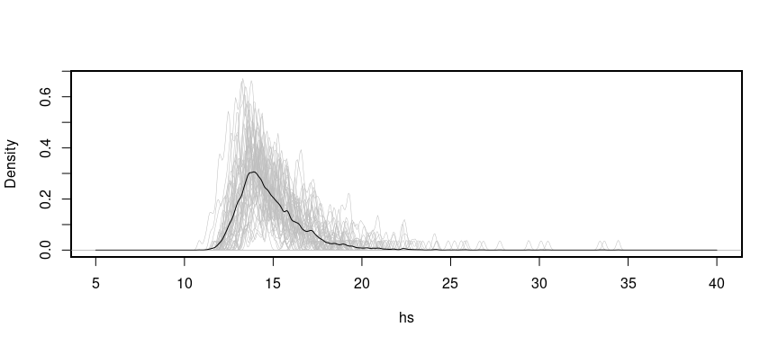<!-- -->

    ## [1] "summary maxes:"
    ##    Min. 1st Qu.  Median    Mean 3rd Qu.    Max. 
    ##   10.84   13.61   14.46   14.86   15.72   34.44

``` r
abline(v = max(df_pick$pots$hs), col = "gray", lwd = 2)
rvs <- NULL
for (i in 1:length(dhs$maxvals)){
  rvs[[i]] <- quantile(unlist(dhs$maxvals[[i]]), exp(-1))
}
rv100_q4 <- quantile(unlist(dhs$maxvals),exp(-1))  # q4 estimator
rv100_q2p <- mean(unlist(rvs))  # q'2 estimator
abline(v = rv100_q2p, col = "blue", lwd = 2)
abline(v = rv100_q4, col = "paleturquoise2", lwd = 2)
legend("topright",
       legend = c("Max observed hs",
                  "RV100 (q'2)",
                  "RV100 (q4)"),
       col = c("gray", "blue", "paleturquoise2"),
       lwd = 2,
       bty = "n")  # removes box around legend
```

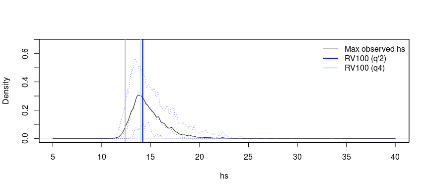<!-- -->

## Compute joint models testing various thresholds

``` r
# check various thresholds ###
maxd_thr <- seq(.5,.98,.01)
models_maxds_thr <- NULL
syst <- system.time(
for (t in seq_along(maxd_thr)){
 print(c('## t:', maxd_thr[t]))
 models_maxds_tmp <- fit_maxds_bstrp(bstrp_pots_lst,
                                     models_margs,
                                     maxd_thr[t],
                                     nbstrp=nbstrp)
 models_maxds_thr[[t]] <- models_maxds_tmp
}
)

print(syst)
```

``` r
# diagnose effect of threshold choice
diagnose_maxds(models_maxds_thr, maxd_thr, 'hs', 'tm2', ylim=c(-1.5, 1.5))
```

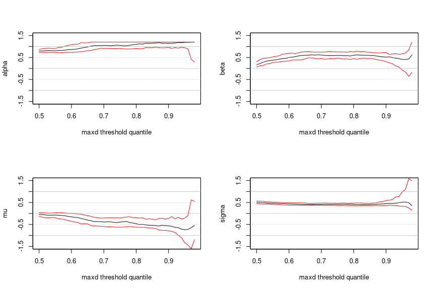<!-- -->

## Choose threshold range from test and sample across

``` r
maxd_thr_range <- c(.6,.8)
syst <- system.time(
models_maxds <- fit_maxds_bstrp(bstrp_pots_lst,
                                models_margs,
                                maxd_thr,
                                nbstrp = nbstrp)
)

print(syst)
```

# Diagnose by comparing data against nsim HT2004 simulations

``` r
nsim <- 100
diagnose_maxds_fitted(models_maxds[[2]], "tm2", "hs", nsim)
```

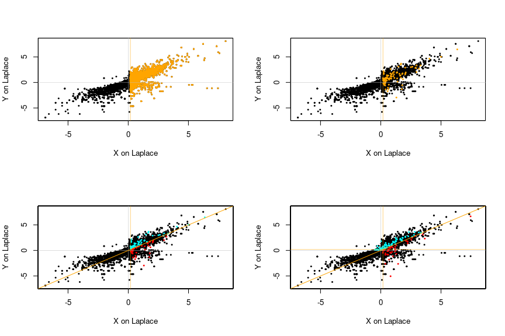<!-- -->

``` r
diagnose_maxds_fitted(models_maxds[[2]], "hs", "tm2", nsim)
```

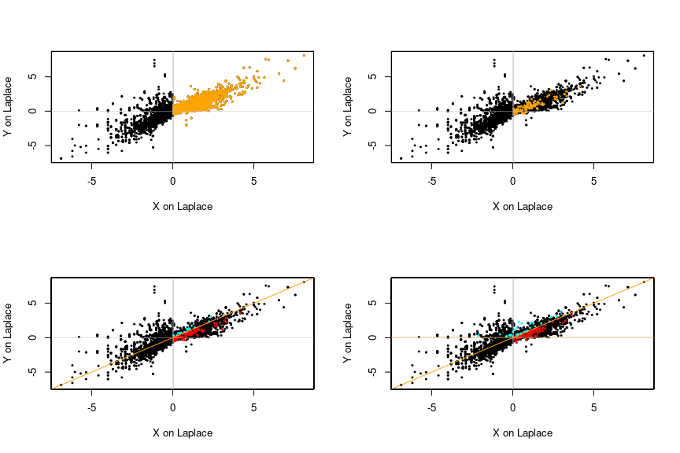<!-- -->

## Simulate joint 100yr events

``` r
# predict on Laplace space
preds_maxds_LP <- predict_from_HT2004_models(models_margs, models_maxds,
                                             c('tm2','hs'), nbstrp,
                                             preds=preds_margs_lst)
# convert to real space
preds_maxds <- convert_HT2004_preds_to_original_space(models_maxds,
                                                      preds_maxds_LP,
                              preds_margs_lst,
                                                      var_lst = c("tm2", "hs"))

# retrieve valid predicted values according to chosen space
valids <- retrieve_valid_HT_samples(preds_maxds,
                                    preds_maxds_LP,
                                    preds_margs_lst,
                                    "hs", c("tm2"),
                                    models_maxds = models_maxds)


df_joint <- data.frame(unlist(valids$X_valid$tm2), unlist(valids$Y_valid$tm2))
colnames(df_joint) <- c("hs", "tm2")

dfcovar <- NULL
for (n in names(valids$covar_valid$tm2[[1]])){
  dfcovar[[n]] <- NULL
  for (b in 1:nbstrp){
    dfcovar[[n]][[b]] <- valids$covar_valid$tm2[[b]][[n]]
  }
}

# add covariates
df_joint[['doy']] <- unlist(dfcovar[['doy']])
df_joint[['Pdir']] <- unlist(dfcovar[['Pdir']])
```

## Plot Joint Distr

``` r
library(ggplot2)
library(metR)
specific_levels <- c(0.01,0.05,0.1)
ggplot() +
  geom_bin2d(data = df_joint,  aes(x = df_joint$hs, y = df_joint$tm2), bins = 50) +
  scale_fill_gradient(low = "white", high = "blue") +  # Color gradient
  geom_density_2d(data = df_joint,  aes(x = df_joint$hs, y = df_joint$tm2), color = "red", size = 0.1, breaks = specific_levels) +  # Density lines
  xlim(5, 25) +  # Extent in the x direction
  ylim(4, 16) +  # Extent in the y direction
  labs(title = "HT2004 predictions",
       x = "Hs [m]",
       y = "Tm2 [s]",
       fill = "Bin density") +
  theme_minimal()
```

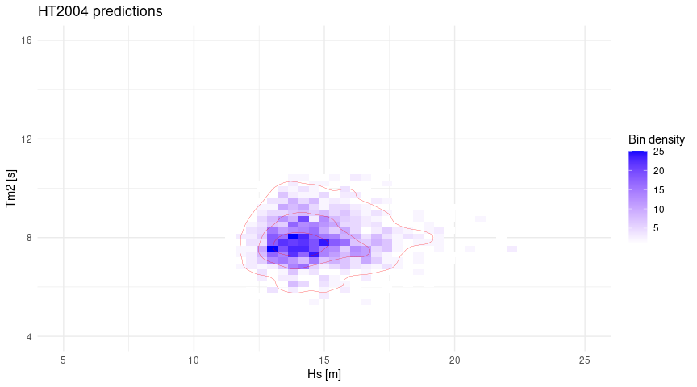<!-- -->

## Simulate storms (matching) given simulated storm peaks

``` r
df_hist_pots <- df_pick$pots
df_hist_storms <- df_pick$storms

# add steepness
df_joint_pots <- df_joint
df_hist_pots[['s_tm2']] <- compute_steepness(df_hist_pots$hs, df_hist_pots$tm2)
df_joint_pots[['s_tm2']] <- compute_steepness(df_joint_pots$hs, df_joint_pots$tm2)

dist_fct_lst <- NULL
dist_fct_lst[['Pdir']] <- 'circ'
dist_fct_lst[['doy']] <- 'circ'
dist_fct_lst[['hs']] <- 'euc'
dist_fct_lst[['tm2']] <- 'euc'
dist_fct_lst[['s_tm2']] <- 'euc'
dist_circ_L_lst <- NULL
dist_circ_L_lst[['Pdir']] <- 360
dist_circ_L_lst[['doy']] <- 365
varlst_matching <- c("hs","s_tm2","doy","Pdir")

nr_of_storms <- 100

df_sim_in <- df_joint_pots[varlst_matching][1:nr_of_storms,]
df_hist_in <- df_hist_pots[c("hs", "s_tm2", "doy" , "Pdir", "tm2", "storm_idx")]
syst <- system.time(
matched_storm_idx <- find_idx_closest_storm_peaks(df_sim_in, df_hist_in,
                                                  varlst = varlst_matching,
                                                  dist_fct_lst = dist_fct_lst,
                                                  dist_circ_L_lst = dist_circ_L_lst,
                                                  sidx = 1, eidx = 100)
)

print(syst)

df_storms_filtered <- df_pick$storms[df_pick$storms$storm_idx %in% matched_storm_idx[1:nr_of_storms], ]

syst <- system.time(
res <- anchor_sim_storms(df_joint_pots, df_hist_pots, df_hist_storms, matched_storm_idx)
)

print(syst)
```

``` r
# plot random storm
vis_sim_storms(res, storm_idx=10, xlim=c(0,16), ylim=c(0,20))
```

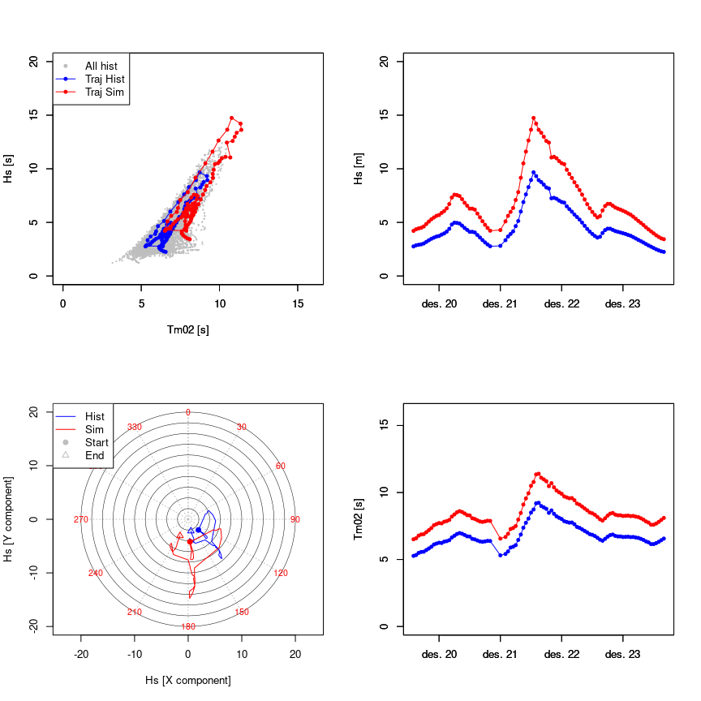<!-- -->

``` r
# plot simulated peaks and storms
show_sim_pop(res, xlim=c(2,19), ylim=c(0,25))
```

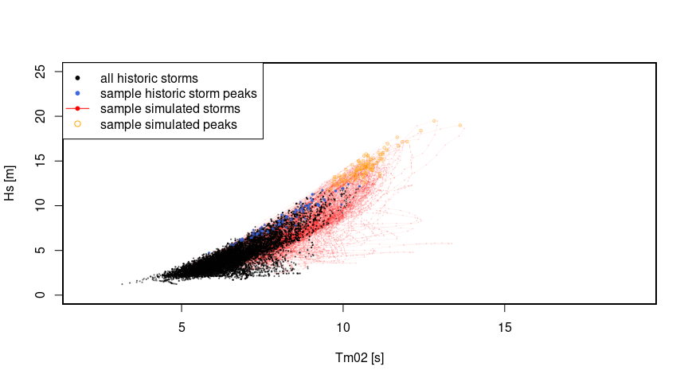<!-- -->

## Compute Hmax given RP peak featuring storms

``` r
# computing Hmax based on RP storm trajectories
hmax_r_lst <- NULL
hmax_f_lst <- NULL
hmax_p_lst <- NULL
syst <- system.time(
for (i in 1:length(unique(res$sim_storms$pseudo_storm_idx))){
  indiv_storm <- subset(res$sim_storms, pseudo_storm_idx == i)
  hmax_r_lst[[i]] <- storm_trajectory_Hmax(indiv_storm$hs, indiv_storm$tm2, 3600, dist='rayleigh', ulim=60)[1] # 1=mode, 2=mean
  hmax_f_lst[[i]] <- storm_trajectory_Hmax(indiv_storm$hs, indiv_storm$tm2, 3600, dist='forristall', ulim=60)[1] # 1=mode, 2=mean
  hmax_p_lst[[i]] <- storm_trajectory_Hmax(indiv_storm$hs, indiv_storm$tm2, 3600, dist='prevosto', ulim=60)[1] # 1=mode, 2=mean
})

print(syst)

hmax_dist_r <- unlist(hmax_r_lst)
hmax_dist_f <- unlist(hmax_f_lst)
hmax_dist_p <- unlist(hmax_p_lst)

# RP hmax
RP_r_hmax <- quantile(unlist(hmax_r_lst), exp(-1))
RP_f_hmax <- quantile(unlist(hmax_f_lst), exp(-1))
RP_p_hmax <- quantile(unlist(hmax_p_lst), exp(-1))
```

``` r
ylim <- c(0, .3)
xlim <- c(10, 50)
# densities
plot(density(hmax_dist_r, bw=1), col='black', ylim=ylim, xlim=xlim, xlab='', ylab='', main='', xaxt = 'n', yaxt = 'n')
par(new=TRUE)
plot(density(hmax_dist_f, bw=1), col='blue', ylim=ylim, xlim=xlim, xlab='', ylab='', main='', xaxt = 'n', yaxt = 'n')
par(new=TRUE)
plot(density(hmax_dist_p, bw=1), col='blue', ylim=ylim, xlim=xlim, xlab='Hmax [m]', ylab='Density', main='', lty=2)
# highest alleged wave
abline(v = quantile(hmax_dist_r, exp(-1)), col = 'black', lty = 1, lwd = 2)
abline(v = quantile(hmax_dist_f, exp(-1)), col = 'blue', lty = 1, lwd = 2)
abline(v = quantile(hmax_dist_p, exp(-1)), col = 'blue', lty = 2, lwd = 2)
abline(v = 23, col = 'red', lty = 1, lwd = 2)
abline(v = 27, col = 'red', lty = 2, lwd = 2)
# legend
legend("topright", legend = c("100yr RL Rayleigh",
                  "100yr RL Forristall",
                  "100yr RL Prevosto",
                  "Alleged highest wave",
                  "Highest observed wave"),
       col = c("black", "blue", "blue", "red", "red"),
       lty = c(1, 1, 2, 2), lwd = c(1, 1, 1, 1, 2))
```

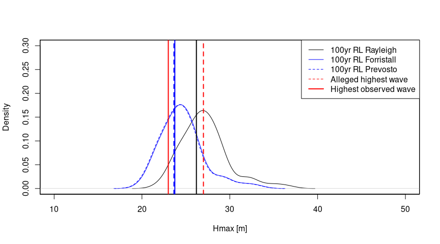<!-- --> \## Only
consider subregions on covariate parameter space (e.g. sector, season,
…)

### subset data for seasonal directional Hmax given a specific parameter subspace

``` r
# plot Hs against covariate parameter space doy and Pdir
# Define your interval
x_min_Pdir_low <- 190
x_max_Pdir_low <- 240

x_min_Pdir_high <- 130
x_max_Pdir_high <- 180

plot(ds$Pdir, ds$hs, pch=20, xlab="", ylab="Hs [m]")
# Add shaded regions
rect(xleft = x_min_Pdir_high, xright = x_max_Pdir_high,
     ybottom = par("usr")[3], ytop = par("usr")[4],
     col = adjustcolor("red", alpha.f = 0.3), border = NA)
rect(xleft = x_min_Pdir_low, xright = x_max_Pdir_low,
     ybottom = par("usr")[3], ytop = par("usr")[4],
     col = adjustcolor("blue", alpha.f = 0.3), border = NA)
```

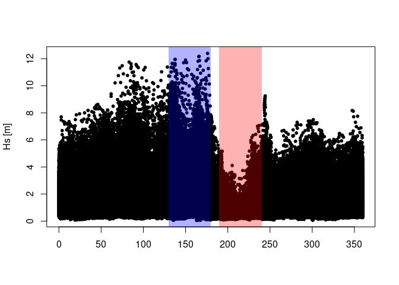<!-- -->

``` r
# choose lowest and highest regions and create subset

hmax_sub_f_lst_high <- NULL
count<-0
for (i in 1:length(unique(res$sim_storms$pseudo_storm_idx))){
  indiv_storm <- subset(res$sim_storms, pseudo_storm_idx == i)
  keep <- subset(indiv_storm, (indiv_storm$Pdir>x_min_Pdir_high & indiv_storm$Pdir<x_max_Pdir_high))
  if (dim(keep)[1]>0){
    count<-count+1
    hmax_sub_f_lst_high[[count]] <- storm_trajectory_Hmax(keep$hs, keep$tm2,
                                                         3600, dist='forristall')[1] # 1=mode, 2=mean
  }
}

hmax_sub_f_lst_low <- NULL
count<-0
for (i in 1:length(unique(res$sim_storms$pseudo_storm_idx))){
  indiv_storm <- subset(res$sim_storms, pseudo_storm_idx == i)
  keep <- subset(indiv_storm, (indiv_storm$Pdir>x_min_Pdir_low & indiv_storm$Pdir<x_max_Pdir_low))
  if (dim(keep)[1]>0){
    count<-count+1
    hmax_sub_f_lst_low[[count]] <- storm_trajectory_Hmax(keep$hs, keep$tm2,
                                                         3600, dist='forristall')[1] # 1=mode, 2=mean
  }
}

RP_f_hmax_low <- quantile(unlist(hmax_sub_f_lst_low), exp(-1))
RP_f_hmax_high <- quantile(unlist(hmax_sub_f_lst_high), exp(-1))
```

## Print results for low and high sector and omni

``` r
cat(sprintf("Low sector: %.2f\nHigh sector: %.2f\nOmni: %.2f\n",
            RP_f_hmax_low, RP_f_hmax_high, RP_f_hmax))
```

    ## Low sector: 14.20
    ## High sector: 23.43
    ## Omni: 23.74

## Apply to synthetic, univariate, non-stationary data

``` r
# load 50yrs of data with WB 3 parameter distributed storm peaks
# including seasonal cycle and auto-correlation of \lambda=1
data(ds_subset)

# plot density
plot(density(ds_subset$y, bw=.01),
     xlim=c(-0.1,10), ylim=c(0,.5), col='orange',
     main="", xlab="", ylab="Density")
```

<!-- -->

## Apply envex pipeline

``` r
# number of years covered by dataset
nr_of_years <- 50

# choose primary variable
prime_varstr = 'y'

# make formula
formula_string <- paste(prime_varstr, "~ te(doy, bs = c('cc'), k = 8)")
peak_picking_thr_model_fml <- as.formula(formula_string)


# decorrelation time scale of 1 day
# this corresponds to 24 consecutive x values
system.time(df_pick <- peak_picking(ds_subset, peak_picking_thr_model_fml,
                                    decorrelation_time_scale = 24,
                                    idx=TRUE, time_str='x', var_str='y'))
```

    ## [1] "apply threshold model to data"
    ## [1] "label storms"
    ## [1] "combine and relabel storm peaks that are too close"
    ## [1] "find peaks for combined storms"

    ##    user  system elapsed 
    ##  19.247   0.712  19.966

## Plot picking result

``` r
visualize_storm_picking(dfin = df_pick, dfinall = ds_subset,
                        xstr = "x", ystr = prime_varstr,
                        sidx = 1, eidx = 4200, ylim=c(0,8))
```

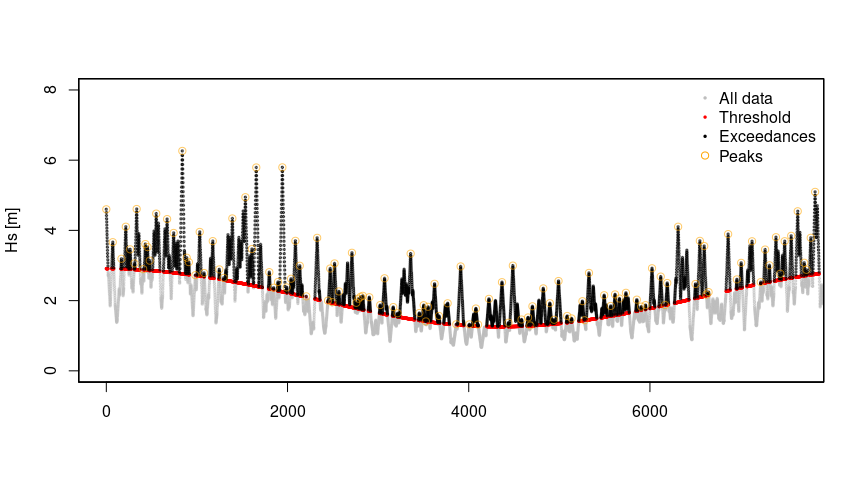<!-- -->

## Continue with workflow and bootstrap

``` r
# number of bootstrap/resampling steps
nbstrp <- 50  # e.g. nbstrp = 20 for testing

system.time(res_bstrp <- run_bootstrap_storms_pots(df = df_pick$storms,
                                                   group_col = "storm_idx",
                                                   n_boot = nbstrp,
                                                   max_var = prime_varstr))

bstrp_storms_lst <- res_bstrp$boot_samples
bstrp_pots_lst <- res_bstrp$boot_max

library(ppgam)
library(extraDistr)
library(ggplot2)
library(extRemes)
# define knots for cyclic splines
knots <- list(doy = c(0,366))

# threshold range from cross-validation
thr_range <- list('hs'=c(.75,.85))

# define models
fml_pp <- ~ te(doy, bs = c('cc'), k = 6)
fml_gpd <- list(exc ~ te(doy, k = 6, bs=c("cc")),
                ~ te(doy, k = 6, bs=c("cc")))
fml_ald <- y ~ te(doy, bs=c("cc"), k=6)

model_fml_thr <- NULL
model_fml_gpd <- NULL
model_fml_occ <- NULL
model_fml_occ[['y']] <- fml_pp
model_fml_thr[['y']] <- fml_ald
model_fml_gpd[['y']] <- fml_gpd

syst <- system.time(
models_margs <- fit_margs_bstrp(bstrp_pots_lst,
                                model_fml_thr, model_fml_occ, model_fml_gpd,
                                extr_thr=thr_range, nr_of_years,
                                thr_str = 'thr',
                                list_var = c('y'),
                                nbstrp = nbstrp,
                                nquad = 225,
                                knots = knots)
)
print(syst)

RP <- 100  # return period
nmc <- 100  # number of mc samples for each bootstrap sample

syst <- system.time(
preds_margs_lst <- predict_margs(models_margs, nr_yrs_subdata, RP=RP,
                                 nmc = nmc, var_lst = c('y'), nbstrp = nbstrp,
                                 covarstr_lst = c('doy'),
                                 grid_interval = list('doy'=1))
)
print(syst)
dy <- diagnose_margs_preds_density(preds_margs_lst, 'y', bw=.1)

# predict 1yr results for q3 estimator
# 1yr maxima
# more simulations due to prediction horizont
syst <- system.time(
preds_margs_1yr_lst <- predict_margs(models_margs, nr_yrs_subdata, RP=1,
                                     nmc = nmc, var_lst = c('y'), nbstrp = nbstrp,
                                     covarstr_lst = c('doy'),
                                     grid_interval = list('doy'=1))
)
print(syst)

dy_1yr <- diagnose_margs_preds_density(preds_margs_1yr_lst, 'y', bw=.1)
rv100_q3 <- quantile(unlist(dy_1yr$maxvals), .99)
```

## Compare results against the “Truth”

``` r
plot(density(unlist(dy$maxvals), bw=.1), xlim = c(0,11), ylim=c(0,1.5),
     main="", xlab = "y", ylab = "Density")
par(new=TRUE)
plot(density(unlist(dy_1yr$maxvals), bw=.1), xlim = c(0,11), ylim=c(0,1.5),
     main="", xlab = "", ylab = "", xaxt = 'n', yaxt = 'n', lty=2)
par(new=TRUE)
plot(density(ds_subset$y, bw=.1), xlim = c(0,11), ylim=c(0,1.5),
     main="", xlab = "", ylab = "", xaxt = 'n', yaxt = 'n', lty=3)

abline(v = max(df_pick$pots$y), col = "gray", lwd = 2)

# value is known from original full 10000yrs
abline(v = 8.43, col = "red", lwd = 2)

rvs <- NULL
for (i in 1:length(dy$maxvals)){
  rvs[[i]] <- quantile(unlist(dy$maxvals[[i]]), exp(-1))
}
rv100_q4 <- quantile(unlist(dy$maxvals),exp(-1))  # q4 estimator
rv100_q2p <- mean(unlist(rvs))  # q'2 estimator
abline(v = rv100_q2p, col = "blue", lwd = 2)
abline(v = rv100_q4, col = "paleturquoise2", lwd = 2)
abline(v = rv100_q3, col = "darkred", lwd = 2)

legend("topleft",
       legend = c("All data",
                  "Sim annual maxima",
                  "Sim RP maxima",
                  "Max observed hs",
                  "RV100 (q'2)",
                  "RV100 (q3)",
                  "RV100 (q4)",
                  "Truth (q3 from data)"),
       col = c("black", "black", "black", "gray", "blue", "darkred", "paleturquoise2", "red"),
       lwd = 2,
       lty = c(3,2,1,1,1,1,1,1),
       bty = "n")  # removes box around legend
```

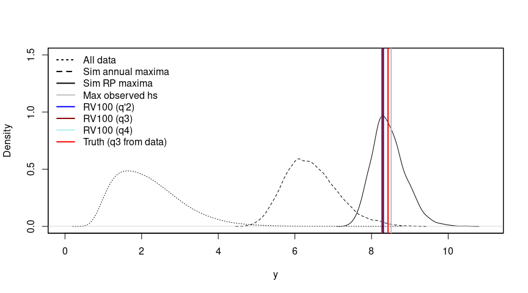<!-- -->

## Notes

## License

## Development

To rebuild this README:

``` r
devtools::build_readme()
```
