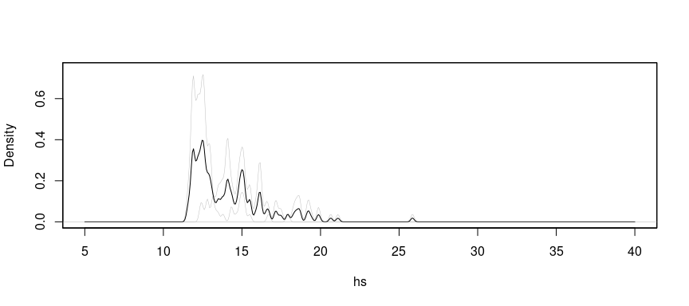
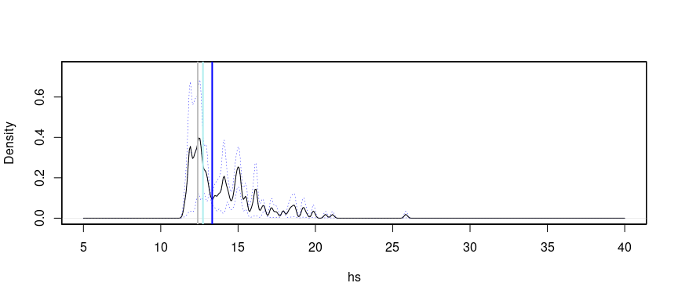

# MyPackage

<!-- badges: start -->
<!-- badges: end -->

EnvEx provides functions to model non-stationary and joint extremes.
Examples for a common metocean use case are provided.

## Installation

You can install the development version from GitHub with:

``` r
```

## Example

This is a basic example showing storm and peak picking.

``` r
# If installed:
library(evgam)
library(envex)

# subset ds_ekofisk to what is needed

ds <- df_ekofisk[, c("time", "hs", "wind_speed_10m", "tp", "tm2", "Pdir", "doy", "dt")]

# reduce data for test from 1976-01-01 to 1986-01-01
# ds_sub <- ds[1:87673,]  # 10 yrs for quicker testing

# choose primary variable
prime_varstr = 'hs'

# make formula
nknots <- c(4, 6)  # c(8, 12), c(6, 8) is default c(4, 6) for testing
formula_string <- paste(prime_varstr, "~ te(doy, Pdir, bs = c('cc', 'cc'), k = nknots)")
peak_picking_thr_model_fml <- as.formula(formula_string)

# decorrelation time scale of 1 day
df_pick <- peak_picking(ds, peak_picking_thr_model_fml,
                        decorrelation_time_scale = 1)
```

    ## [1] "apply threshold model to data"
    ## [1] "label storms"
    ## [1] "combine and relabel storm peaks that are too close"
    ## [1] "find peaks for combined storms"

``` r
# additional variables were added, i.e. exc, thr, and storm_idx
```

## Plot the resulting storms, storm peaks, and thresholds

``` r
visualize_storm_picking(dfin = df_pick, dfinall = ds,
                        xstr = "dt", ystr = "hs",
                        sidx = 1, eidx = 4200)
```

<!-- -->

## Plot the Hs density

``` r
par(mfrow = c(1, 3))
plot(density(df_pick$pots$hs, bw=.1))
plot(density(df_pick$storms$hs, bw=.1))
plot(density(ds$hs, bw=.1))
```

<!-- -->

## Bootstrap the storms

``` r
# number of bootstrap/resampling steps
nbstrp <- 2  # e.g. nbstrp = 10 for testing

system.time(res_bstrp <- run_bootstrap_storms_pots(df = df_pick$storms,
                                                   group_col = "storm_idx",
                                                   n_boot = nbstrp,
                                                   max_var = prime_varstr))
```

    ##    user  system elapsed 
    ##   0.744   0.000   0.744

``` r
bstrp_storms_lst <- res_bstrp$boot_samples
bstrp_pots_lst <- res_bstrp$boot_max
```

## Plot the sampled within storm Hs densities

``` r
for (b in seq_len(nbstrp-1)) {
  plot(density(bstrp_storms_lst[[b]]$hs, bw=.1), xlim=c(0, 15), ylim=c(0., .5), xlab = "", ylab = "", xaxt = "n", yaxt = "n", main = "")
  par(new=TRUE)
}
plot(density(bstrp_storms_lst[[b+1]]$hs, bw=.1), xlim=c(0,15), ylim=c(0.,.5), main = "", xlab = "Hs", ylab = "Density")
```

<!-- -->

## Plot the sampled storm peak Hs densities

``` r
## Plot the within storm Hs
for (b in seq_len(nbstrp-1)) {
  plot(density(bstrp_pots_lst[[b]]$hs, bw=.1), xlim=c(0,15), ylim=c(0.,.5), xlab = "", ylab = "", xaxt = "n", yaxt = "n", main = "")
  par(new=TRUE)
}
plot(density(bstrp_pots_lst[[b+1]]$hs, bw=.1), xlim=c(0,15), ylim=c(0.,.5), main = "", xlab = "Hs", ylab = "Density")
```

<!-- -->

## Model the non-stationary storm peaks

``` r
library(ppgam)
library(extraDistr)
library(ggplot2)
library(extRemes)
# define knots for cyclic splines
knots = list(doy = c(0,366), Pdir=c(0,360))
# indicate variable that needs ppgam weights
node_str_lst = c('Pdir')
# number of years covered by original dataset
nr_of_years <- 48

# threshold range from cross-validation
thr_range <- list('hs'=c(.8,.9))

# define models
fml_pp <- ~ te(doy, Pdir, bs = c('cc', 'cc'), k = c(6,8))
fml_gpd <- list(exc ~ te(doy, Pdir, k=c(6,8), bs=c("cc","cc")),
                ~ te(doy, Pdir, k=c(6,8), bs=c("cc","cc")))
fml_ald <- hs ~ te(doy, Pdir, bs=c("cc","cc"), k=c(6,8))

model_fml_thr <- NULL
model_fml_occ <- NULL
model_fml_gpd <- NULL
model_fml_thr[['hs']] <- fml_ald
model_fml_occ[['hs']] <- fml_pp
model_fml_gpd[['hs']] <- fml_gpd

models_margs <- fit_margs_bstrp(bstrp_pots_lst,
                                model_fml_thr, model_fml_occ, model_fml_gpd,
                                extr_thr=thr_range, nr_of_years,
                                thr_str = 'thr',
                                list_var = prime_varstr,
                                nbstrp = nbstrp,
                                nquad = 225,
                                knots = knots,
                                node_str_lst = node_str_lst)
```

    ## [1] "Considered variables:" "hs"                   
    ## [1] "number of bootstraps is:" "2"                       
    ## [1] "bootstrap nr:" "1"            
    ## [1] "fit threshold model"
    ## [1] "fit threshold model for" "hs"                     
    ## [1] "subset to pots above threshold"
    ## [1] "subset dataset for" "hs"                
    ## [1] "fit GPD model"
    ## [1] "fit gpd model for" "hs"               
    ## [1] "computing weights and creating nodes"
    ## [1] "fit occ model"
    ## [1] "fit occurrence model for" "hs"                      
    ## [1] "bootstrap nr:" "2"            
    ## [1] "fit threshold model"
    ## [1] "fit threshold model for" "hs"                     
    ## [1] "subset to pots above threshold"
    ## [1] "subset dataset for" "hs"                
    ## [1] "fit GPD model"
    ## [1] "fit gpd model for" "hs"               
    ## [1] "fit occ model"
    ## [1] "fit occurrence model for" "hs"

## Simulate 100yr maxima

``` r
RP <- 100
nmc <- 100
preds_margs_lst <- predict_margs(models_margs, nr_yrs_subdata, RP=RP,
                                 nmc = nmc, var_lst=c('hs'), nbstrp = nbstrp,
                                 covarstr_lst = c('Pdir','doy'),
                                 grid_interval = list('Pdir'=1, 'doy'=1))
```

    ## [1] "number of boostraps (predict_margs):"
    ## [2] "1"                                   
    ## [1] "produce storms"
    ## [1] "nr_of_events:" "1104"         
    ## [1] "sum(predcounts)" "2763.566318467" 
    ## [1] "lambda_max"         "0.0296618277273189"
    ## [1] "proposal_N:" "3330"       
    ## [1] "nr_of_sims:" "2321"       
    ## [1] "predict threshold"
    ## [1] "predict exceedences"
    ## [1] "number of boostraps (predict_margs):"
    ## [2] "2"                                   
    ## [1] "produce storms"
    ## [1] "nr_of_events:" "874"          
    ## [1] "sum(predcounts)"  "2762.70779411207"
    ## [1] "lambda_max"         "0.0256939660804343"
    ## [1] "proposal_N:" "2240"       
    ## [1] "nr_of_sims:" "1811"       
    ## [1] "predict threshold"
    ## [1] "predict exceedences"

## Plot resulting simulated peaks

``` r
dhs <- diagnose_margs_preds_density(preds_margs_lst, 'hs', bw=.1, xlim=c(5,40))
```

<!-- -->

    ## [1] "summary maxes:"
    ##    Min. 1st Qu.  Median    Mean 3rd Qu.    Max. 
    ##   11.53   12.42   13.55   14.15   15.12   25.85

``` r
df_ekofisk <- readRDS(file = "/home/patrikb/R-projects/envex/data/df_ekofisk.rds")
abline(v = max(df_ekofisk$hs), col = "gray", lwd = 2)
rvs <- NULL
for (i in 1:length(dhs$maxvals)){
  rvs[[i]] <- quantile(unlist(dhs$maxvals[[i]]), exp(-1))
}
rv100_q4 <- quantile(unlist(dhs$maxvals),exp(-1))  # q4 estimator
rv100_q2p <- mean(unlist(rvs))  # q'2 estimator
abline(v = rv100_q2p, col = "blue", lwd = 2)
abline(v = rv100_q4, col = "paleturquoise2", lwd = 2)
```

<!-- -->

## Notes

## License

## Development

To rebuild this README:

``` r
devtools::build_readme()
```
